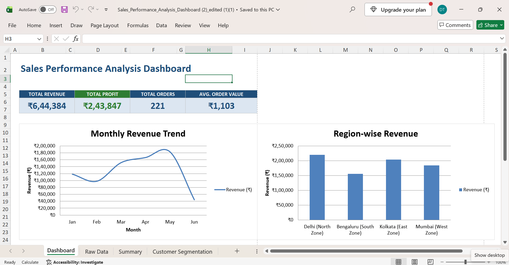
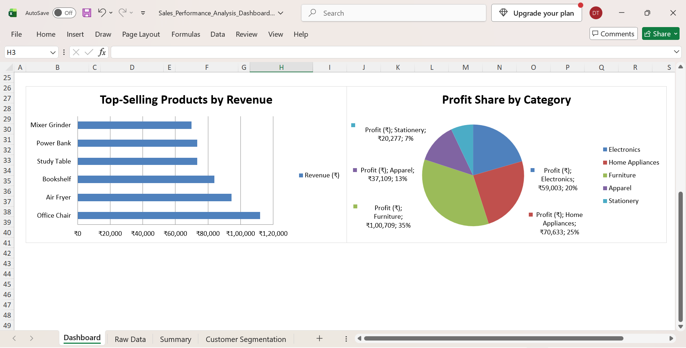

SALES PERFORMANCE ANALYSIS DASHBOARD

A Microsoft Excel-based sales analytics project developed to analyze revenue, profit, orders, regional performance, product performance, and customer behavior.

PROJECT OVERVIEW

This project transforms raw sales transaction data into meaningful business insights using Microsoft Excel.
The project includes raw sales data, sales performance summary analysis, dashboard visualizations, and customer segmentation using RFM analysis.
The analysis focuses on understanding sales trends, profitability, regional performance, product performance, and customer behavior.

OBJECTIVES

1) Analyze overall sales revenue and profitability.
2) Monitor monthly sales and order performance.
3) Compare revenue and profit across different regions.
4) Analyze revenue and profit across product categories.
5) Analyze revenue and profit generated by individual products.
6) Identify products contributing significantly to sales revenue.
7) Calculate and monitor average order value.
8) Segment customers using RFM analysis.
9) Analyze customer churn risk.

TOOLS AND TECHNIQUES

1) Microsoft Excel
2) Data Cleaning and Preparation
3) Excel Formulas
4) Data Analysis
5) Data Visualization
6) Dashboard Development
7) RFM Analysis
8) Customer Segmentation
9) Business Analytics

KEY PERFORMANCE INDICATORS

1) Total Revenue: Rs. 6,44,384
2) Total Profit: Rs. 2,43,847
3) Total Orders: 221
4) Average Order Value: Rs. 1,103

SALES PERFORMANCE ANALYSIS

The Sales Performance Analysis Summary provides four major views of business performance.

1. MONTH-WISE REVENUE AND PROFIT

The month-wise analysis evaluates revenue, profit, and order performance from January to June 2026.

This analysis helps identify changes in sales performance over different months and provides a clear view of monthly business trends.

The analysis includes:

1) Monthly Revenue
2) Monthly Profit
3) Monthly Orders

2. REGION-WISE REVENUE AND PROFIT

The region-wise analysis compares sales performance across four geographical regions.

The regions analyzed are:

1) Delhi - North Zone
2) Bengaluru - South Zone
3) Kolkata - East Zone
4) Mumbai - West Zone

The analysis includes:

1) Regional Revenue
2) Regional Profit
3) Regional Orders

3. CATEGORY-WISE REVENUE AND PROFIT

The category-wise analysis evaluates revenue and profit generated by different product categories.

The categories analyzed include:

1) Electronics
2) Home Appliances
3) Furniture
4) Apparel
5) Stationery

This analysis helps understand the contribution of different product categories to overall business performance.

4. PRODUCT-WISE REVENUE AND PROFIT

The product-wise analysis compares revenue and profit generated by individual products.

Products displayed in the dashboard include:

1) Office Chair
2) Air Fryer
3) Bookshelf
4) Study Table
5) Power Bank
6) Mixer Grinder

This analysis helps identify products with significant revenue and profit contributions.

CUSTOMER SEGMENTATION AND RFM ANALYSIS

The Customer Segmentation analysis uses the RFM framework to understand customer purchasing behavior.

RFM represents:

1) Recency - How recently a customer made a purchase.
2) Frequency - How frequently a customer placed orders.
3) Monetary - How much a customer spent.

Based on RFM characteristics, customers are grouped into different segments, including:

1) Champions
2) Loyal Customers
3) Potential Loyalists
4) At Risk

The analysis also includes churn-risk classification to identify customers based on their level of churn risk.

DASHBOARD ANALYSIS

The dashboard provides a consolidated view of sales performance through visual analysis.

The dashboard includes:

1) Total Revenue
2) Total Profit
3) Total Orders
4) Average Order Value
5) Monthly Revenue Trend
6) Region-wise Revenue
7) Top-Selling Products
8) Profit Share by Category
9) Customer Segmentation
10) Churn Risk Distribution

DASHBOARD PREVIEW

SALES PERFORMANCE OVERVIEW

PRODUCT AND CATEGORY ANALYSIS

PROJECT FILES

1) Sales_Performance_Analysis_Dashboard.xlsx - Complete Excel workbook containing the raw data, analysis, dashboard, and customer segmentation.
2) dashboard-1.png.png - Sales performance dashboard screenshot.
3) dashboard-2.png.png - Product and category analysis dashboard screenshot.
4) README.md - Project documentation.

SKILLS DEMONSTRATED

1) Data Analysis
2) Data Cleaning
3) Data Visualization
4) Microsoft Excel
5) Dashboard Development
6) Business Analytics
7) RFM Analysis
8) Customer Segmentation
9) Business Insight Generation

PROJECT OUTCOME

This project demonstrates the process of transforming raw sales transaction data into structured business insights using Microsoft Excel.
The resulting dashboard provides a consolidated view of sales performance, profitability, regional trends, product performance, and customer behavior.
The project demonstrates practical application of data analysis and visualization techniques to support business performance monitoring and decision-making.
